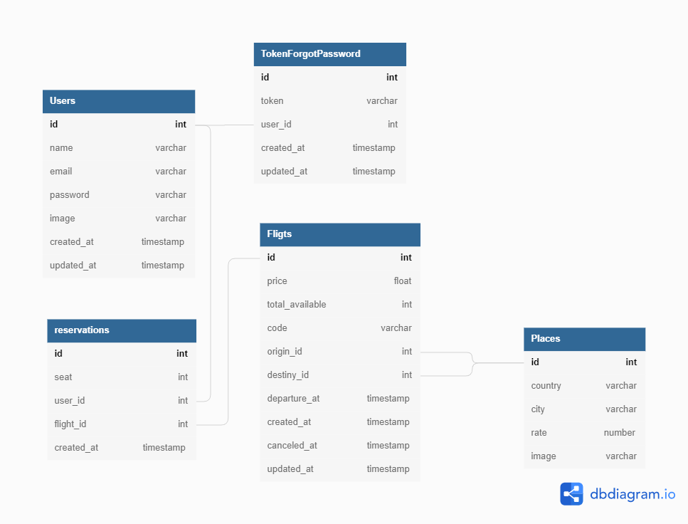

# API FLIGHT TICKET

## Diagrama de relacionamentos

## Rotas

- Reservation

| Method | Route                      |
| ------ | -------------------------- |
| POST   | /api/v1/reservation/buy    |
| PUT    | /api/v1/reservation/list   |
| GET    | /api/v1/reservation/update |
| DEL    | /api/v1/reservation/delete |

---

- Flight

| Method | Route                 |
| ------ | --------------------- |
| POST   | /api/v1/flight/new    |
| PUT    | /api/v1/flight/update |
| GET    | /api/v1/flight/list   |
| GET    | /api/v1/flight/search |
| DEL    | /api/v1/flight/delete |

---

- Place

| Method | Route                |
| ------ | -------------------- |
| POST   | /api/v1/place/create |
| PUT    | /api/v1/place/update |
| GET    | /api/v1/place/list   |
| DEL    | /api/v1/place/delete |

---

- User

| Method | Route                       |
| ------ | --------------------------- |
| PUT    | /api/v1/user/update         |
| GET    | /api/v1/user/account        |
| GET    | /api/v1/user/delete         |
| DEL    | /api/v1/user/download-image |

---

- Auth

| Method | Route           |
| ------ | --------------- |
| POST   | /api/v1/sign-up |
| POST   | /api/v1/sign-in |
